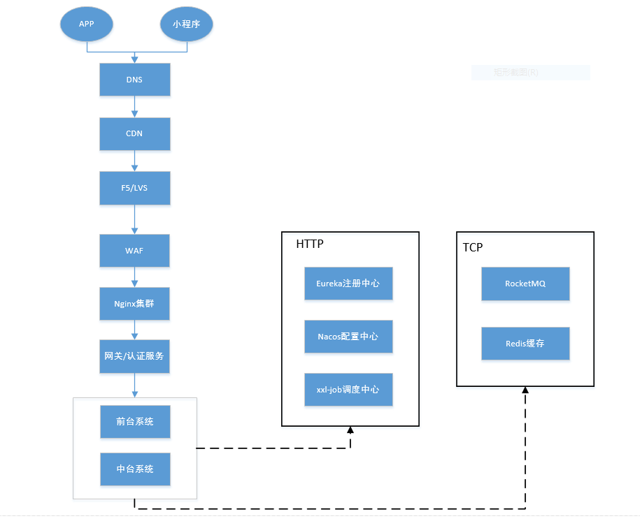

# spring-cloud-demo
spring cloud 组件搭建完整系统
## 1.技术架构

## 2.网络架构

## 3.技术选型
* 注册中心 Eureka
* 网关 Gateway
* 认证授权中心 security、oauth2
* 配置中心 nacos
* 缓存 redis
* job调度 XXL-Job
* MQ消息 RocketMQ
* 搜索 ElasticSearch

## 4.组件服务
### 4.1 Eureka
各个服务注册与发现
    
### 4.2 Gateway
* 请求转发
* 限流
* 熔断
* token认证

### 4.3 auth
* 认证 security
* 授权 oauth2

